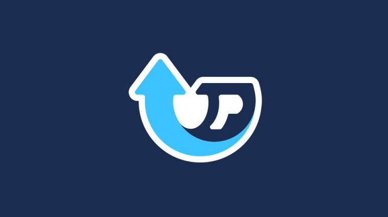
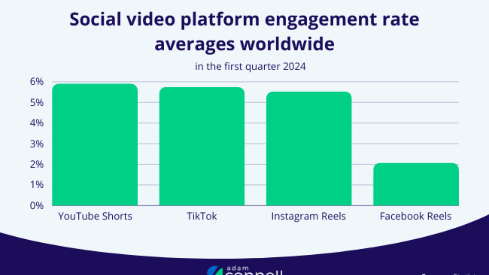
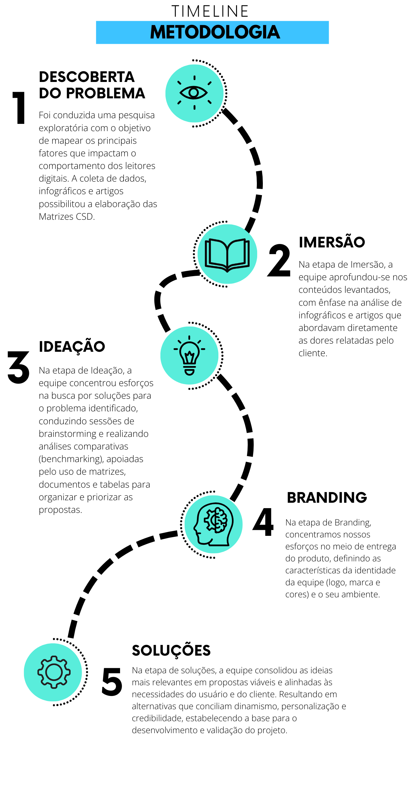
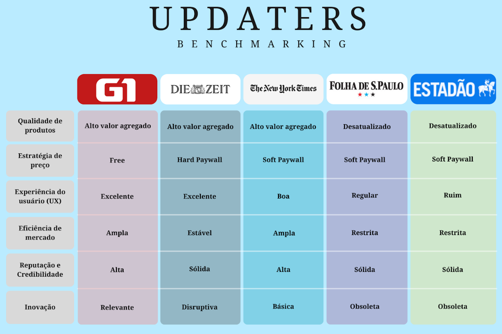

# 🚀 UPDATERS

  

---

## 🚀 Sobre nós

Somos a **UPDATERS**, um coletivo de designers e desenvolvedores da **CESAR School**.  
Reimaginamos serviços e criamos **soluções digitais** que combinam **excelência técnica** e **design centrado no ser humano**, impulsionando o sucesso dos nossos parceiros.

### 🌍 Nossa missão
- **Missão**: Aproximar pessoas da informação por meio de experiências digitais inovadoras.  
- **Visão**: Ser referência nacional em design e tecnologia aplicada à mídia.  
- **Valores**: Empatia, colaboração, inovação e impacto social.

### 👨‍💻 Nossa equipe
| Membro           | Função               |
|------------------|----------------------|
| Antonio Manoel   | UX / UI Designer     |
| Artur Prazeres   | Design de Interação  |
| Breno Santiago   | Product Owner        |
| Filipe Correia   | Dev Frontend         |
| Gabriel Ribeiro  | Design de Produto    |
| João Carlos      | Dev Backend          |
| João Henrique    | Design Gráfico       |
| João P. Carvalho | Dev Frontend         |
| João P. Pessôa   | Dev Full Stack       |
| Mateus Dornellas | Dev Backend          |
| Thiago Carvalho  | Design de Branding   |
| Walter Maia      | Scrum Master         |

### 📅 Nossa jornada
- 🎓 **2025**: Nascemos na CESAR School.  
- 📰 **2025**: Primeiro grande projeto — modernizar a experiência digital do **Jornal do Commercio**.  
- 🚀 Estamos só começando a transformar o futuro da mídia no Brasil.

---

## 📰 Cliente: Jornal do Commercio (JC)
- 🏛 Fundado em **1919**, com sede em Recife/PE.
- 📰 Integra o **Sistema Jornal do Commercio de Comunicação (SJCC)**.
- ⭐ Um dos veículos mais **tradicionais e influentes** do Brasil.
- 💻 Evoluiu de jornal impresso para **plataforma multimídia** (portal online, rádios e TV).

---

## 🎯 O Problema
O **Jornal do Commercio** vem enfrentando desafios na **retenção e fidelidade digital**:

- 📉 Queda de cliques e acessos no portal.
- ⚡ Concorrentes mais adaptados às **novas tendências digitais**.
- 💔 Baixa conexão emocional com usuários.
- 🔎 **SEO deficiente** e perda de relevância no Google.
- 📢 Alocação inadequada de anúncios, prejudicando **experiência e receita**.

---

## 📍 Onde e Como ocorre?

O problema acontece principalmente nos **portais digitais** do JC, onde há grande volume de acessos, mas baixa retenção.  
Usuários chegam até as páginas por mecanismos de busca, porém não exploram outras seções — resultando em visitas **curtas e isoladas** (ausência do “segundo clique”).

---

### 🔎 Jornada do Usuário

*Exemplo: usuário chega via busca → acessa 1 notícia → não navega mais.*

---

### 📊 Dados ilustrativos

*Representação visual: A cada ano que passa mais usuários consomem notícias via rede social, principalmente utilizando vídeos curtos.*

---

### 😕 Experiência atual

*Usuário acessa o portal, mas não encontra estímulo para continuar navegando.*

---

### ✨ Oportunidade

*Com novas soluções de design e conteúdo, podemos transformar visitas curtas em **engajamento contínuo**.*

---

## 👥 Quem é impactado?
- **O JC** → perde relevância, engajamento e fidelização.
- **Usuários** → não têm uma experiência contínua e deixam de acessar conteúdos relevantes.

---

## 🔎 Causas e Consequências

**⚠️ Causas**
- Foco em tráfego via Google sem estratégia de retenção.
- Conteúdos e interfaces que não incentivam navegação contínua.
- Falta de recursos para engajamento.
- Algoritmos do Google favorecendo portais mais fiéis.

**📉 Consequências**
- Redução do tempo médio no site.
- Menor fidelidade e engajamento.
- Queda no ranqueamento.
- Impacto no **recall da marca** e nos números de acesso.

---

## 🛠️ Como nós funcionamos

Nosso processo criativo segue **4 etapas principais**:

1. **🔍 Imersão** → Desk Research, Protopersona, Mapa de Empatia, Benchmarking.
2. **💡 Ideação** → Insights, Mapa Analítico, Storyboard, Cards de Ideias.
3. **🎨 Branding** → Leis de Gestalt, Mood Board, Grid de Proporção.
4. **🚀 Saída** → Conteúdos relevantes, títulos chamativos, imagens de qualidade e criação de comunidade.

---

## ⌛ Timeline

  

Essa Timeline apresenta parte do nosso trabalho de forma sequencial.

---

## 📊 Benchmarking

  

Analisamos portais de notícias para identificar oportunidades:

- 🟥 **G1**
- 📰 **Diário de Pernambuco**
- 🟦 **Folha de São Paulo**
- 🟨 **Estadão**

> Essa análise comparativa nos ajudou a compreender **oportunidades de melhoria** em conteúdo, design, usabilidade e engajamento.

---

## 🚀 Nossa Missão
- 📈 Aumentar a **retenção e engajamento** no portal do JC.
- 💌 Criar novas formas de **conexão emocional** com leitores.
- 🔎 Reforçar a **marca JC** no ambiente digital.
- 🛠️ Unir **tecnologia + design + experiência centrada no usuário**.

---

## 👥 Equipe UPDATERS
👨‍💻 Designers e desenvolvedores da **CESAR School**, unidos para transformar experiências digitais.

  <b>✨ Somos os UPDATERS. Transformamos desafios em soluções. ✨</b>

