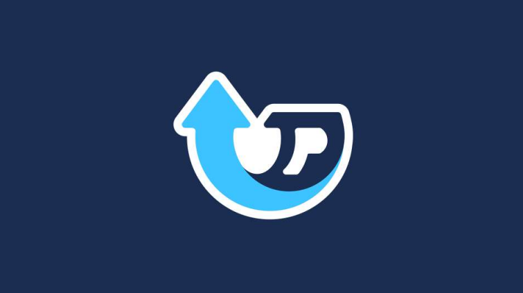

# 🚀 UPDATERS

  

---

## 🚀 Sobre nós

Somos a **UPDATERS**, um coletivo de designers e desenvolvedores da **CESAR School**.  
Reimaginamos serviços e criamos **soluções digitais** que combinam **excelência técnica** e **design centrado no ser humano**, impulsionando o sucesso dos nossos parceiros.

### 🌍 Nossa missão
- **Missão**: Aproximar pessoas da informação por meio de experiências digitais inovadoras.  
- **Visão**: Ser referência nacional em design e tecnologia aplicada à mídia.  
- **Valores**: Empatia, colaboração, inovação e impacto social.

### 👨‍💻 Nossa equipe
| Membro           | Função               |
|------------------|----------------------|
| Antonio Manoel   | UX / UI Designer     |
| Artur Prazeres   | Design de Interação  |
| Breno Santiago   | Product Owner        |
| Filipe Correia   | Dev Frontend         |
| Gabriel Ribeiro  | Design de Produto    |
| João Carlos      | Dev Backend          |
| João Henrique    | Design Gráfico       |
| João P. Carvalho | Dev Frontend         |
| João P. Pessôa   | Dev Full Stack       |
| Mateus Dornellas | Dev Backend          |
| Thiago Carvalho  | Design de Branding   |
| Walter Maia      | Scrum Master         |

### 📅 Nossa jornada
- 🎓 **2025**: Nascemos na CESAR School.  
- 📰 **2025**: Primeiro grande projeto — modernizar a experiência digital do **Jornal do Commercio**.  
- 🚀 Estamos só começando a transformar o futuro da mídia no Brasil.

---

## 📰 Cliente: Jornal do Commercio (JC)
- 🏛 Fundado em **1919**, com sede em Recife/PE.
- 📰 Integra o **Sistema Jornal do Commercio de Comunicação (SJCC)**.
- ⭐ Um dos veículos mais **tradicionais e influentes** do Brasil.
- 💻 Evoluiu de jornal impresso para **plataforma multimídia** (portal online, rádios e TV).

---

## 🎯 O Problema
O **Jornal do Commercio** vem enfrentando desafios na **retenção e fidelidade digital**:

- 📉 Queda de cliques e acessos no portal.
- ⚡ Concorrentes mais adaptados às **novas tendências digitais**.
- 💔 Baixa conexão emocional com usuários.
- 🔎 **SEO deficiente** e perda de relevância no Google.
- 📢 Alocação inadequada de anúncios, prejudicando **experiência e receita**.

---

## 📍 Onde e Como ocorre?

📍 O problema acontece principalmente nos **portais digitais** do JC.   

⚠️ Mesmo sem um volume expressivo de acessos, o portal sofre com **baixa retenção**.  

🔎 Usuários chegam até as páginas por mecanismos de busca,  
mas **não exploram outras seções** — resultando em visitas:  

➡️ **Curtas**  
➡️ **Isoladas**  
➡️ Com ausência do **“segundo clique”**

---

## 👥 Quem é impactado?
- **O JC** → perde relevância, engajamento e fidelização.
- **Usuários** → não têm uma experiência contínua e deixam de acessar conteúdos relevantes.

---

## 🔎 Causas e Consequências

**⚠️ Causas**
- Foco em tráfego via Google sem estratégia de retenção.
- Conteúdos e interfaces que não incentivam navegação contínua.
- Falta de recursos para engajamento.
- Algoritmos do Google favorecendo portais mais fiéis.

**📉 Consequências**
- Redução do tempo médio no site.
- Menor fidelidade e engajamento.
- Queda no ranqueamento.
- Impacto no **recall da marca** e nos números de acesso.

---

## Construção das Histórias do Usuário

### ✅ Base das histórias
- Criadas a partir de pesquisas de **produtos similares** e **levantamento sobre os usuários**.  
- Fundamentadas na **protopersona Gen Z**, identificada como público principal.  

### 👤 Foco no usuário (Gen Z)
- Necessidade de conteúdos rápidos, visuais e interativos.  
- Preferência por formatos que lembram **redes sociais** (ex.: feed dinâmico, stories, vídeos curtos).  
- Busca por proximidade, engajamento e possibilidade de interação.  

### 📝 Formulação das histórias
- Estruturadas no formato **“Eu, como usuário, quero ... para ...”**, transmitindo de forma simples a necessidade.  
- Priorização de histórias que refletem **experiência fluida**, **facilidade de uso** e **consumo de notícias em formato visual**.  

### 📲 Inspiração no Instagram
- Interface próxima de uma rede social: **scroll contínuo**, **conteúdo multimídia**, **curtidas/comentários/compartilhamentos**.  
- Ênfase em elementos de **interação** e **personalização**.  

### 🎯 Objetivo das histórias
- Ajudar a guiar a construção de um **portal de notícias dinâmico**.  
- Tornar o consumo de notícias **mais atrativo, engajador e próximo da rotina digital do público jovem**.  

#### Para ter acesso as nossas histórias, [clique aqui](links/UPDATERS_HISTÓRIAS.pdf).
---

  <b>✨ Somos os UPDATERS. Transformamos desafios em soluções. ✨</b>

